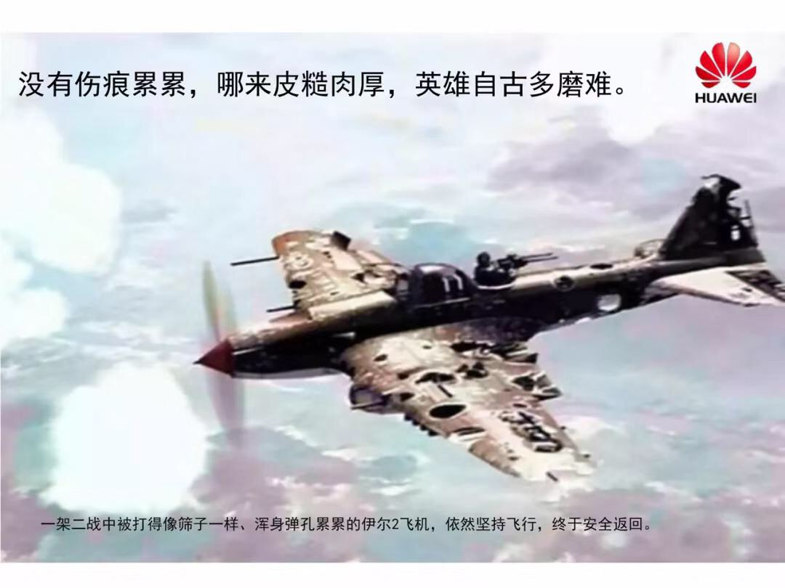

# Interview with Huawei's CEO - Full English Text

On 5/21/2019, Ren Zhengfei interviewed with China Central Television and other major Chinese media at Huawei's headquarters. He discussed the Trump administration, Huawei's relationship with Google, and other things. Below is the full English text of the interview.
---
## Q1
Reporter: Let me begin by saying that I have been a live journalist, and you are ex-military, so we both have a good sense of time. And time goes fast. We last spoke about four months ago in an interview, at the same place as today. Back then everyone thought Huawei was at its lowest point, which attracted a lot of media attention, which was also why you spoke with reporters from around the world. It was hard to imagine that four months later, Huawei is now in a position that's even more complicated and strenuous. Some reporters have just pulled out a photo of a "beat-up plane". I have the same photo, and have heard that this is your favorite photo. 

> Ren: I saw that photo in an online forum called "Wukong Q&A", and thought it actually looked similar to the state of our company, so I shared it. Our Carrier Network Business Group (CNBG) thought that they were the plane in the photo, so they marketed themselves as such. Now that we've looked at the situation objectively, CNBG is actually not in the biggest trouble, because they have been prepping themselves for more than a decade. We're now fixing the plane as we fly it, and hope to return safely to base.
		
Reporter: This plane can return because its key components are intact, such as the oil tank and the engine. It is only partially injured in its wings and some non-vital parts. What if the engine is hit? How can it return in that case?

> Ren: Let me tell you two stories: post-WWII Germany and post-WWII Japan. Germany refused to surrender, so it kept getting bombed. The location where the Yalta Conference took place was left alone, but everywhere else was bombed to ashes. Similar things happened to Japan. If they didn't surrender, the US would probably have erased mosted of the country. But Japan compromised, surrendered and saved their emperor. The country wasn't completed destroyed, but a lot of its industrial infrastructure was. 
> 		
> There was a famous saying back then, which went something like: "As long as we have the people, we can start over." So Germany started over and rebuild everything. Japan also recovered quickly, thanks to their talents, their education, and their foundation; that that's the most important point. You can lose anything and everything, but not the people. The integrity, the skills and the confidence of the people are essential. 
		
Reporter: Yesterday, the US decided to delay the Huawei ban for 90 days, in other words you have a 90-day grace period. What do you think about this? What can you do in 90 days? If the news is true that the 90-day delay might be revoked, how would you respond?

> Ren: First of all, the 90-day grace peroid doesn't mean much to us, and at this point we are ready for the ban. The best thing we can do is to be the best of ourselves, and we really don't have much sway over the US government. I do have to point out that I am grateful for a lot of US companies as they have accompanied our growth in the past thirty years, helped us a lot, and showed us the path forward. It is no secret that most of Huawei's consulting partners are from the US, such as IBM and Accenture. We have dozens of partners like them. 
> 		
> Secondly, many US-based component and equipment makers have given us tremendous support over the years, especially in times of need. They have shown integrity. Two days ago, when Xu Zhijun (Huawei's Vice-President and rotating CEO) called me at three in the morning and told me that our US suppliers are working against the clock to help us increase inventory, I teared up a bit. As the saying goes, "Support comes to those who show quality." To this day, many US firms are still communicating with the administration about this matter. 
> 		
> We are placed on the sanctioned "Entity List", and US-based companies must obtain government approval before selling anything to us. The US is a legal state and its corporations must obey the law. I don't think the media should critisize the US companies, who need more help than criticism. If they have to blame someone, then they should probably blame the politicians. If we blindly attack the US with stick, we wind up beating only the little guys and not the big bullies. The media should understand that US tech companies and Huawei are on the same boat. We are all part of the global market economy.
> 		
> The US politicians did what they did, probably because they underestimated our strength. I don't want to comment too much on that, because it's discussed quite clearly in He Tingbo's letter to our employees, and well-reported by the mainstream media. (He Tingbo is the CEO of Haisi, Huawei's semiconductor subsidiary) Coming back to the beat-up plane analogy, we don't have a plan-B, or "spare tire", for some of our niche products, which we are planning to gradually phase out anyway. There will be some impact on those products for the moment. We won't be affected in areas where we take the lead, 5G being an example. We actually have a two-to-three-year lead in that particular area.
		
## Q2
Reporter: I want to ask you about chips. In an interview with the Japanese press on the 18th, you had mentioned "Huawei doesn't need American chips. We will be fine." This went viral on social media and many people over the Internet praised that you had guts. Where do Huawei's "guts" come from? How have you been preparing?

> Ren: We will always need American chips. Our US partners are trying to get government approval right now. If the approval goes through, we'll still be buying from them, and selling to them too. So we won't categorically reject America and pursue narrow-minded self-growth. We want to grow together with everybody else. 
> 		
> If there indeed appears to be a problem with our supply, we won't be in trouble either, because we can produce all of our high-end chips. In "peaceful times", we adopt a 1+1 policy, where we buy half of our chips, and make the other half. It is cheaper for us to make our own chips, but we are still willing to purchase American chips, even though they have a higher price tag, because we cannot isolate ourselves from the rest of the world. It's better to blend in.
> 		
> Our friendship with US companies are built over several decades, and it's really hard to tear that up with a piece of paper. We will keep purchasing components from the US as long as Washington feels ok with that. We are in a bit of a rush right now, so I don't think the approval will be granted soon, although some buffer is nice. If our US partners get the approval in time, it will be business as usual. After all, we must build the information era together, not alone.
> 		
> The Japanese press took my words out of context. The ability to make our own chips doesn't mean the intention to break our partnerships. 
		
## Q3
Reporter: You said before that Huawei doesn't want to be a lone ranger, that it wants cooperation. And now you're preparing for both outcomes. Would you agree that the current American protectionism is to interrupt your global supply chain and muddle the market?

Secondly, for some time now the US government has been questioning Huawei's management, finances and all sorts of other things. Why do you think they are picking on you?

> Ren: I cannot speak for the politicians. I don't think the US will be at a disadvantage just because we take the lead in certain technology. 5G is not nuclear bomb. It's is meant to be a tech advancement for everyone.
> 		
> 5G's capacity is 20X over 4G and 10,000X over 2G; the power consumption per bit is 1/10 of 4G, and the hardware size is 30% smaller. A 5G base station is quite compact. It is about the size of a briefcase and weights about 20kg, which means we don't need to erect new towers. They can be mounted on a pole or on the wall. We have also developed anti-erosion materials that could last several decades, so it's entirely possible to put a 5G base station in the sewage. 
> 		
> This is a perfect solution for Europe, because they have many old cities and cannot build signal towers everywhere like China does. This is not to say that China's existing towers will go wasted; we can mount 5G base stations on them and save building new ones. We also don't need special cranes to mount the thing, which also saves about 10,000 Euros a piece.
> 		
> In the old days, you need cranes to mount the base stations on top of the towers. To do that you also need to block the road. Now someone can just go up the tower with the 5G base station in a briefcase. Simple as that.
> 		
> Also, 5G has powerful bandwidth that can support a lot of HD content. Transmitting 8k videos would be easy. It's often marketed that 5G brings about 10X cost reduction, but with all things considered we're looking at about 100X. When everyone has easy access to HD content, that also brings about cultural advancement. Culture, philosophy, and education, these are the backbone of any country's development. In that regard, 5G can change an entire society. Plus it has super-low latency, making it great for industrial use.
> 		
> You asked if our engine is hit. We may have some holes in our wings, but our core technology is well protected, and it's world-leading too. When it comes to the cutting-edge stuff, we have backed up our back-up.
		
Reporter: Do you think the global market is being disrupted?

> Ren: Not really. Europe won't necessary follow the US and our US partners have been closely communicating with us.
		
## Q4
Reporter: Speaking of the influence to Huawei. The general public in China feels very enthusiastic about the Haisi letter (that Huawei has always had a plan-B), while tech-insiders took a more objective stance about chips made in China, including how far China is behind the US. How mature are Huawei's self-developed chips right now? How can you ensure uninterrupted supply in the days to come? Is there a tipping point?

> Ren: Why don't we take a "cold bath" first. I think we should stay calm. Without real strength, getting too enthusiastic and shouting slogans aren't going to help you win any war.
> 		
> We should acknowledge the width and depth of America's scientific achievements. There is a lot that we lack and to look up to. Some seemingly small US companies have developed technologies that are beyond cutting-edge. We (Huawei) are focused on our own vertical and we're starting to take the lead, but there is still a wide technological gap between the two countries.
> 		
> If you compare Huawei with certain tech leaders, I think we are pretty close; but when it comes to China vs US, we're still pretty far behind. This has a lot to do with our economic bubbles in recent years: peer-to-peer, Internet, finance, real estate, knock-offs, just to name a few. As a result, academia in China has also become bubbly. It takes decades for any foundational scientific theory to take form. If no ones pays attention to the foundation and people spend all their energy shouting empty slogans, China won't become any stronger. We must take solid steps in real research. 
		
## Q5
Reporter: About the chips. He Tingbo's open letter was very inspiring. I saw that Haisi was founded in 2004 and has developed many of its own chips over the years. What was the genesis story? How was the decision made? He (Tingbo) mentioned "living on the edge", and two days ago you said "we don't need American chips anymore." Can you shed some light on the progress over the years? Does the current progress meet your expectations? If American chip supplies are off the table, can you continue to service your customers?

> Ren: I have made a lot of personal sacrifices in terms of spending time with my family, and I did that for the dream of becoming a global tech leader. Now people are getting all riled up and shouting about "conquering the world", and it's hard to contain that enthusiasm. I used to disallow that kind of talk at Huawei. Nevertheless, to achieve this dream, we're bound to have some conflict with the US.
> 		
> To avoid that conflict, in early 2000, we thought about wearing a "cowboy hat" and selling Huawei to a US company at the price of $10 billion. We signed the contract and did all the paperwork. The only thing left was waiting for their board's final approval. So our guys bought new clothes, jogged on the beach, played ping-pong. We were almost there.
> 		
> During this time the board of our American counterpart had some changes, and their new president didn't like the deal, so the deal was rejected at the last minute. Our thought at the time was that going around the world in a cowboy hat was not so bad. But after the incident all of our young members in senior management abandoned the idea, so I went along.
> 		
> I told the team that sooner or later we'll meet again with America, probably at the "summit", and that we need to be prepared. So we have been preparing for the "summit duel" ever since. But eventually I think it'll be a "summit hug" and we'll work together to push the human race forward.
		
Reporter: All levels of Huawei's management have been saying that they are able to continue to service their clients. Are the current affairs going to affect that?

> Ren: We can absolutely continue to service our clients. Our production is going strong and isn't affected much by the "Entity List". Our bids around the world is business as usual. Growth will probably slow down a bit, but not by much. Our Q1 YoY growth was 39%; in April that number went down to 25% and it is likely to decrease further by the end of the year. But we won't have negative growth or see much damage to our industry.
		
## Q6
Reporter: What do you think are the damages to the industry if supply from the US is cut? A couple of days ago, Fang Zhouzi (an Internet commentator) posted on Weibo, saying "if your 'spare tire' works, why haven't you used it until now?" What do you think about this comment?

> Ren: If we only use our own stuff, then yes, we're innovating, but we're also isolating ourselves while we actually want to make friends around the world. Fang doesn't understand the concept of "strategic thinking." We don't want to hurt our partners. It helps us to help them.
> 		
> As I mentioned before, I never told any American supplier that we'll stop using their components; quite the contrary, we want to use their components and we want to collaborate. In the early days, we shared our development insights with our global partners. Sometimes we would ask the partners to manufacture the new inventions fresh out of our own labs, instead of confining them within our own factories. That's how we earned their trust. "If your 'spare tire' works, why haven't you used it until now?" Well, it's a spare tire. Why would we use it when the current tires are running well?
		
Reporter: If a supply issue really surfaces, how would it affect the industry?

> Ren: For us there won't be extreme cases of supply shortage, because we're prepared. At the beginning of the year, I didn't think it would happen until maybe two years from now, until after the court makes a ruling on our lawsuit against the US government, although I am fully aware that it will eventually happen. We thought we had a two-year window, but after Meng Wanzhou (Ren's daughter)'s arrest, the timeline was shortened.
> 		
> Many people know that our employees worked through the Chinese New Year, and I was very grateful. Our security, cleaning and cafeteria staff, more than 5000 of them at our China office, was also there to provide support. We doubled their compensation for the overtime, our food purchasing department paid our vendors double the money, plus extra tip to the cafeteria waiting staff. A lot of our employees didn't go home and slept on the floor, working against the clock.
		
## Q7
Reporter: Speaking of the 'spare tire', the back-up plan, how much has Huawei spent on it? Would you have kept investing in it if it were never to be used?

> Ren: A lot, and it's hard to say exactly how much. We made budgeting plans for the 'main tire' and the 'spare tire' together. The 'main tire' used to get the larger share, now the 'spare tire' does. I don't know exactly how much we've spent, because the reports always come in dozens of pages, and I don't ask questions about pennies. I only look at the high level metrics. The nitty-gritty of the reports is accumulated little-by-little, and we have tens of thousands of engineers working on that.
		
## Q8
Reporter: When the US ban is in effect, Huawei's partners in Japan, Europe and Taiwan will be your main support line. Do you think the US government will put pressure on companies like TSMC (Taiwan Semiconductor Manufacturing Company) if this ban doesn't go through? After all, Huawei is one chip maker, it cannot protect itself from the entire industry.

> Ren: If enough players won't budge, then the industry won't budge. I wouldn't worry too much about it.
		
Reporter: About Google, this has made customers in Europe worry. They're worried that Huawei won't be able to use the newest Android OS. How do you plan to deal with that?

> Ren: Google is a great company and a highly responsible one. They are also trying to persuade the Trump administration. Our experts are also working on alternative plans, and I can't fully answer that question right now.
		
## Q9
Reporter: How long do you think it will go on like this? Do you think this will be an important turn in Huawei's course of history?

> Ren: I'm the wrong person to ask; you should ask Trump. I think this coin has two sides: on one hand we'll take some hit; on the other hand China will be encouraged to take systematic and solid steps developing its own IT industry.
> 		
> China used to throw money at development problems, but it doesn't always work. It works for building bridges, roads and houses, but but for chips. For chips, we need mathematicians, physicists and chemists. But how many students are really paying attention at school? How many doctor dissertations are really producing novel ideas? With this reality, it is very hard for China to rely everything on innovation. So why don't we look beyond the nation's border? Maybe we can build innovation centers wherever the talents are.
> 		
> Granted, many talents are returning to China, and that's a great thing. But individual taxes in China are much higher than many other countries. It is unrealistic to expect all those talents to behave like "Lei Feng" and sacrifice everything for the country. Right now, for top talents to return to China, there is no real incentive, only higher personal taxes. There are recent talks about reducing taxes to 15% in the Guangdong-Hong Kong-Macao Greater Bay Area (GBA), but it's unclear how this tax break works. Does the person need to register their Hukou (China's household registration system) in GBA? Does it only work if he or she physically works in GBA? If so, what good is the tax break? Scientists are liquid, and you can't tie they down like an office worker for eight hours a day. We need to create better paths for world-leading scientists to come home.
> 		
> In the first global talent migration, three million Jews moved from the Soviet Union to Israel, which made Israel a high-tech paradise. Now another global talent migrations seems to be happening. The US is embracing protectionism, so a lot of talents are blocked out of top research facilities. There was a leading US press that wrote, "If China invents the cure for cancer, would that also be a national security threat to the US?" This was in response to a US cancer research facility terminating the positions of three Chinese researchers. 
> 		
> Many scientists are losing faith in America, so why don't we welcome them home? They are asking questions like, "how am I supposed to do that? I don't even know where to send my kids to school. I can't buy a car because I don't have 'Hukou'. And the tax isn't any lower." We should change our policy to be more open to the world. Two hundred years ago the American land didn't have much, except the native American people; and now it's a world-leading power, because it adopted the right policy. China goes back five thousand years, so why don't we utilize this foundation to our advantage, and create a better policy that welcomes entrepreneurs from around the globe?
> 		
> Many countries in Eastern Europe are not rich, yet many American leaders, scientists and financiers come from that region. Why can't we invite more Eastern European talents to China? Or maybe establish research facilities in Eastern Europe?
> 		
> China has a long way to go before we can be free of America's restrictions, because it lacks in basic scientific theories. Things only got slightly better in recent years. I used to speak about the importance of math at science conferences, and I heard it has recently gotten easier for math graduates to find jobs.
> 		
> How many people really want to major in maths? I wasn't a math-major student, and I once said I wanted to pick up math after I retire. A university president asked me what I wanted to learn math for, I said I wanted to learn the second law of thermodynamics, so I could learn more about the beginning of the universe. He said I would be welcomed. But I cannot retire yet, so maths would have to wait.
> 		
> I majored in engineering, and I learned Advanced Mathematics at school, which was like the easiest of real mathematics. China can only become stronger if we make solid changes to the education of maths, physics, chemistry, neurology, brain science, etc. 
> 		
> The Chinese philosophy has mostly been mysterious metaphysics. We had Buddhism, but it was in Sanskrit. Tang Seng (the Chinese monk who  brought Buddhism to China) should've translated the thing, but he didn't. The western world had a more logical approach to their philosophy and science. They created disciplines like physics, chemistry, maths, geometry, etc., which accelerated their industrial development that allowed them to conquer the world. I'm not saying that the mysterious Chinese metaphysics is useless, it could work well in the virtual world. China's gaming industry is growing fast, and that could bring VR to other parts of people's lives. Of all the AI scientists in the world, about half of them are Chinese. If they're not welcomed elsewhere, let's welcome them here in China. Let's build a foundation for them to innovate.
> 		
> I think if we can find a way to attract real talents, that's better than trying to blindly invent everything. It could save a lot of time.
		
## Q10
Reporter: Is Huawei currently testing the Hongmeng OS (Huawei's own mobile OS)?

> Ren: I can't answer that today. We have developed an operating system, but not necessarily to replace other mobile OS. We need our OS in AI and IoT as well, although I cannot speak to exactly how it is being used.
		
Reporter: A lot of articles out there are saying that "Huawei has shocked the world."

> Ren: Our employees are not feeling much shock, or fear. We're just doing our thing. The Internet likes to exaggerate. Someone said Infineon (a German semiconductor manufacturer) has stopped working with us, which is total nonsense. 
> 		
> If you really want to know about Huawei's culture, you should visit our company community forum. We don't take down complaining posts in the forum; instead, our HR will look into the complaint. If the person is making a good point, we'll see how we can make things better. If the person has good job performance in the past three years, we will even invite him or her to work at the executive secretary office and help us solve some problems. It's a sort of training for them to become future leaders.
> 		
> People who only sing praises are not doing us any favors. The criticism in our company forum talks about concrete matters, which require concrete analysis. If we don't exercise self-criticism, we would not have survived to this day.
		
## Q11
Reporter: Everyone is concerned with Huawei's "spare tire" project. You have been talking about the influence of international affairs to Huawei since about ten years ago.

> Ren: I don't remember exactly when I first started talking about the "spare tire" project. Those emails are public and well documented. I had discussed it many times, but the world wasn't paying much attention back then. Now that we're under attack, and everybody is suddenly interested in the "spare tire."
		
Reporter: You have been thinking about long-term risk aversion, the continuity of the business, the macro and the micro; now that this expectation becomes real, and the effect more serious that some people had imagined, are you starting to think any differently? There has been all kinds of analyses about the China-US trade war and how it might present challenges to Huawei. Now that the challenge is here, any new ideas?

> Ren: The continuity of the business and the "spare tire" are the same thing. The whole point of having a spare tire is to keep driving when you blow a tire. We achieved this continuity step by step, and many projects have been in production for a while. Even so, we have been buying half of our chips from our partners. I said in another article that we purchase at least 50 million sets of chips from Qualcomm every year, so we have never boycotted anybody. 
> 		
> The biggest "spare tire" the world has ever seen is the nuclear bomb, which doesn't have much use. It has never been used since the end of WWII. But a lot of officials in China had a good political career because they were related to the development of the nuclear and hydrogen bombs. They either demonstrated talent, or dedication, or both. There were examples of people being appointed Provincial Governor at the age of 40, while many people I know were struggling to find a job at the same age. People on the Internet have made "spare tire" a new catch-phrase, but it is nothing special within our company. He Tingbo has also become famous because of her letter about our "spare tire." She posted it the night the US government ordered the ban, because she couldn't hold it any longer. It's been hard for her, working on the project for many years without receiving much credit. 
		
Reporter: So what you're saying is that, the "spare tire" has always been there, and you weren't sure if you were ever going to use it?

> Ren: We were going to use it for sure, but only if it's a good solution to a particular problem. We weren't going to use it just for the sake of using it. The plan was to use the "spare tire" when the time seems right, and to rotate it with other solutions.
		
## Q12
Reporter: Right now people have two distinct sentiments about Huawei: 1. Patriotism, equating the support for Huawei to the support for China; 2. Criticism, that Huawei has hijacked people's patriotism. Both sentiments are becoming more and more extreme.

> Ren: My kids use Apple products. Should we say that my children don't love Huawei? Of course not. I say this a lot, and Yu Chengdong (CEO of Huawei's consumer products) would get upset with me; he says I am promoting Apple instead of Huawei. But I'm speaking the truth: loving or not loving Huawei products shouldn't be tied to the patriotism for China. 
> 		
> Huawei products are consumer goods. People should choose as they please, and that choice should not be a political one. Huawei is a commercial organization, and we would never say things like "for the love of China" in our marketing campaigns. There might have been some internal rallies where people made some overly-patriotic speeches, but I immediately ask them to stop making hot-headed speeches like that. It's ok to have team celebrations. It's ok to award and inspire employees. It's ok to discuss politics with a friend. But it's not ok to promote nationalism.
> 		
> I often try to cool people's heads at Huawei, because nationalism is dangerous. A nation's growth requires an "open" road, not a closed one.
> 		
> After the recent China-US meet, CCTV (China Central Television) talked about "open-up" and "reform", and I'm very glad to hear that. In fact, we might have opened up too late. We have made commitments to the WTO, so we should do our part after having enjoyed its benefits. The earlier we pay our obligations, the more friends we will have.
> 		
> China has a lot of cash, but why are we only depositing our money in the US? Why don't we diversify our money in Europe, Russia and Africa? There is no need to worry that them won't pay us back. Even if they don't pay us back in the next year, they'll surely be able to pay us back in the next 100 years. China is not low on cash, and diversifying investments reduces risk. Take agriculture as an example. Why import only from one country? Maybe we can import some agricultural products from Ukraine. The trade can certainly help Ukraine out. Since Ukraine is where Russia puts a lot of its heavy artillery, maybe we can also purchase weapons from Ukraine instead of producing heavy artillery ourselves. You can read General Shoygu (The Ministry of Defense of Russia)'s report. His report is pretty well-written, and explains this stuff better than I do.
		
## Q13
Reporter: You mentioned that it takes more than money to develop chips. We also need physicists and mathematicians. Huawei as a company, and you as a person, had discussed "foundational research and education" in many occasions. What has Huawei done about that? How would that support Huawei's future developments.

> Ren: We have 26 R&D centers around the world. We are currently employing over 700 mathematicians, over 800 physicists and more than 120 chemists. We also have a Strategy and Research Institute that provides financial support to professors at world-renowned universities. We don't think about this expenditure in terms of return-on-investment. Rather, we use an approach similar to the "Bayh–Dole Act", meaning the universities will benefit from the research. In this way, we have more and more scientists willing to work with us. 
> 		
> The benefit of 5G is apparent nowadays, but the 5G standard originated from a mathematics paper by a Turkish professor named Arikan more than ten years ago. We discovered this paper two months after it was published and started doing research around it. We've had several thousand people working on it over the years.
> 		
> In the last ten years, we turned a theory on paper into a usable technology and standard. About 27% of all 5G patents in the world are owned by Huawei, putting us at No. 1 in 5G patent ownership. Professor Arikan is not a Huawei employee, but we fund his lab and he can use the fund to hire doctoral students.
> 		
> There is a Japanese professor. His four doctoral students are all technically on Huawei's payroll, even though they're working at the professor's office. With that the professor can hire four more students. That's a total of eight doctoral students working with him. His team takes the credit for all of their research, and we would purchase it from him if we need it for commercial use. This is basically how we exercise the "Bayh–Dole Act" and extend our relationship with researchers.
> 		
> Last week we had an international science conference. I didn't physically attend the conference, but it was streamed to my conference room. There were some young doctors who were my technical translators. They explained to me how those papers could benefit future generations of humans. We have a lot of these global events, where we can absorb insights and also express our practical needs.
> 		
> Western companies see farther than we do when it comes to talent acquisition. They have good internship and mentorship programs. This is different from simply "graduate and find a job." We have expanded our opportunity to complete for top talents, but there is still a lot to be done.
> 		
> We would extend offers to top university students around the world in as early as their sophomore year. These kids are super smart. For example, Google has been hiring the winners of the International Collegiate Programming Contest at 5-6 times the salary of other companies. Starting this year, we're planning to offer even more lucrative compensation than Google does. We're competing with Google for talents. We don't really ask for "success" from our scientists. When it comes to science, even failures are successes, because scientific talents are being nurtured along the way. This is how we can keep going forward.
		
## Q14
Reporter: I've been to Huawei's labs and saw some interesting inventions, like anti-erosion equipments and heat conductors. They are really just high school science, but it's still amazing to see them in practice. Is this what you mean by "foundational science and education?" How much does it help Huawei in light of the recent event?

> Ren: Nuclear bombs are chain reactions that even middle school students can learn, but the bombs are much harder to make in reality. Foundational science looks very simple in theory, but is very difficult to implement. Therefore, some new product made by foreign countries may seem like a small invention, but it's actually an invention on top of an invention, on top of another invention. There are probably thousands of patents behind a small component. 
		
## Q15
Reporter: Speaking of investing in maths and foundational science, what's the level of Huawei's global investment in this area? What made you realize its importance? What are your goals and expectation on future investments?

> Ren: Let me give you an example. The camera in our P30 phone is pure maths. The photos are not "taken", they are calculated. A human eye is like a hundred million lenses, while the phone camera only has one lens. The image captured by the optical sensor is mathematically divided into tens of millions of pieces, then recreated on the screen.
> 		
> Our mathematicians keep saying "making the phone camera work better than human eyes." I didn't think it was necessary and gave them a hard time about it, but they were very stubborn.  They said "take a picture of the moon and the phone sees a thousand kilometers." Maybe they're right, because under the hood it's all maths.
> 		
> I visited some of them at our research facility in Nice, France, and I asked, "The sea is blue and the sky is blue. Why are your formulas also blue?" Turns out the camera needed some fine-tuning, and they've probably fixed it by now. The reason why we're making tremendous strides in mobile phones is precisely that we've been stocking up our "spare tires." We had some "spare tires" in network infrastructure, but they were not being used, so we moved them over to end-user devices and the technology really blossomed there. We are rolling out a new generation every three months, mostly because of our mathematicians; well, them and the sensors made by our physicists. 
> 		
> So you can't build an electronic industry by buying and putting together spare parts. To be fair, you're still using maths, except that other companies did the maths first and sold it to you in a package at a premium price. In this area, I think we are at a leading position in the world.
		
## Q16
Reporter: For some time now, the US has been trying to bring down Huawei. It also asked Europe to put pressure on Huawei. If the US demands that its allies in Europe reject Huawei, would you personally visit 10 Downing Street or the French government to make sure their door stays open for Huawei?

> Ren: I used to have tea at 10 Downing Street quite often. They asked me how I wished to network with the world. I said, "tea sounds nice." So they invited me to Downing Street for afternoon tea. We have actually been communicating with many world leaders. Every country wants to look after its own interests, and Trump's influence isn't strong enough to make everyone follow.
		
## Q17
Reporter: Last year there was a lot of attention on making accessible phones. Technology has made life relatively easier for the disabled. As a tech leader, what has Huawei done to make your phones more accessible. What do you have in the pipeline?

> Ren: I tried one of our glasses in Japan. With it I could see an employee working from several thousand kilometers away and give him my feedback. Or I could put on the glasses and they could give me guidance on the drawings being displayed. This is something we have today, although I am not sure if it's been launched to the public. 
> 		
> We can produce more accessible phones, but I don't know exactly where we are on that. I can ask them to make some calls to find out. Theoretically we can stimulate the brain to produce sensory. With the glasses I could see my employees from thousands of mile away. But please bear in mind that I was wearing a prototype in the lab, not an actual off-the-shelf product.
		
## Q18
Reporter: Apple has done a lot in education, and it did well.  iPads and iPhones can be great tools for education. Huawei also cares a lot about education, so what has the company done so far? Let's not just talk the talk, I'm more interested to know how you will walk the walk.
		
> Ren: The government has an important role to play in improving the overall education. It's impossible for a company to improve the education of an entire country. I had mentioned the importance of education, but we are not an education company.
> 		
> For China to race against America, education is the only way. The consumer products that facilitate education are a whole other issue. I think the crux is to pay attention to the teachers. If teachers are well-respected, everyone wants to be a teacher. Teachers in Shenzhen are respected, and the respect is also reflected in their salary, so there is an average of 253 candidates for every teacher position. We helped Tsinghua University High School build their branch in Tsinglan. The principal said the school could become one of the best in the country, because the tuition is high. The school recruited 2000 students and it was open to the public. A lot of Huawei's employees wanted to send their kids there, and asked me to pull some strings when their kids couldn't get in. I said there was nothing I can do about it. 
> 		
> I think education will only be significantly better if teachers have higher status and higher pay. Here's why I feel that way. My parents were both teachers in the countryside, in a small minority town in Guizhou Province. What they told me after working as teachers their whole life was, "whatever you do, don't be a teacher." If teachers don't want their children to become teachers, then the country could be in trouble. As teachers, my parents were poor and looked down upon, and growing up I experienced that with them, so I didn't want to become a teacher when I was young.
		
## Q19
Reporter: I have two questions. One, in Huawei's business plan, consumer products is the most important business group, followed by carrier network and enterprise services. In your mind, what would the revenue percentage look like for each group, five to ten years from now? Two, about the positioning of Haisi. Under current circumstances, what role do you want Haisi to play in the future?

> Ren: Haisi is a supporting group, and it follows the main troop. Like in the military you have fueling vehicles, AVLBs and stretchers supporting a tank troop. When it comes to the three business groups, better profitability doesn't necessarily mean higher status. The carrier network division is where we can take the lead in the world. This is the division that the US is aiming at, and also what the "beat-up plane" analogy is referring to. Now it seems this division is in the least trouble, because it's the best prepared. We won't take much hit in areas like 5G, optical transmission and core network. On the contrary, we will be taking the lead in the years to come.
		
## Q20
Reporter: Haisi is recently recruiting from all over the world. When will it become independent?

> Ren: Never. It plays a supporting role and is not the main troop. The network division is the main troop, although it might not generate the most sale. It's like climbing Mount Everest. It's an important summit to conquer, but there isn't a lot of real estate up there. This is the same summit that the US is trying to reach, but they couldn't yet, so they're using political means to slow us down. We're not going to give up the summit for money. 
		
## Q21
Reporter: Even though Huawei has prepared for potential interruption to its business, there are servers, base stations and all kinds of components. That's a lot of moving parts. Where does your optimism come from?

> Ren: We laid out our problems, and now we'll just solve them one at a time.
		
## Q22
Reporter: I want to ask you something about research. Huawei spends a lot of money on research. What are the key directions of your research? What kinds of technology do you have in stock?

> Ren: We've been charging at the same guarded wall (metaphor for 5G) for thirty years. There used to be hundreds of people assaulting that wall, now the troop has tens of thousands of people. Eventually, we'll bring it down. Beside, our ammunition level is an annual budget of $20 billion dollars. There is no public company in the world that would use so much ammo at a single wall.
> 		
> Our efforts evolve around facilitating information flow. Terminal devices are like faucets, and carrier network is the pipe. The more we focus on building the pipeline, the more likely that we'll lead the world. We're actually going to increase our ammo level.
> 		
> Even if we take a hit in our finance, that would not affect our investment in technology. Our employees are not greedy, and they have enough money. Some of our researchers spouses would save and not spend, and I tell them it's ok to lavish a little sometimes. If you ask me "who is the 'Lei Feng' (a generous person who always helps others) at Huawei?" I would encourage you to visit a luxury goods store, and ask the ladies would just bought several designer bags at a time "where does you husband work?" She says "Huawei." You find her husband's employee number, and there is your Lei Feng. He works hard and earns money for his wife to spend. 
> 		
> Back to your question about research. We'll stay in our current vertical and don't plan to deviate. The Internet says that we're making electric vehicles. We're not. Our IoV (Internet of Vehicles) group is a key supplier to some of the most prominent car makers in the world, so we'll naturally focus on on-board computing and on-board electronics. That's a pretty big market itself. We work with other companies on self-driving cars. Then send us a gift car and slap Huawei's logo on it. That doesn't mean Huawei is making an EV. These are just imaginary stories; we're not going to easily change our vertical. 
		
## Q23
Reporter: You are concerned with foundational education. Is there a chance that's you'll take part in that in the future?

> Ren: Foundational education is the responsibility of the whole nation, while companies have their own set of responsibilities. Let's say we're the "tank troop". Before the tank troop goes into battle, you can't just bring kids with their text books and ask the kids to charge ahead. Huawei's biggest responsibility is to build a colossal global network. We're now connecting 3 billion people world wide, especially in Africa. There isn't a lot of money to be made in building networks in Africa, and western companies don't want to go there, so we did. The real threat to the world is if Huawei no longer exists.
> 		
> We're not going become an education company, because our main troop actually needs to be leaner and we'll break off some divisions and let them freely charge ahead alongside us. Like in the Battle of Huaihai, civilian workers would send in food on wheelbarrows, and they need to be paid. When our teams were working overtime during the Chinese New Year, the support staff was about 5000 people. That was our "civilian organization", so we paid more and paid bonuses. 
		
## Q24
Reporter: To outsiders like us, you seem very philosophical about Huawei's management. What do you think is at the core of Huawei's management philosophy? Do you think it is time to show the world that philosophy? There are many books about "Huawei's secret to success." Is there indeed a secret? Can other company's imitate "the Huawei Way?"

> Ren: There is no special philosophy. I haven't read many philosophy books. I have never met with any of those book authors, so I guess they just made things up. "The Huawei Way" in those books is just their own opinion, and I don't think there's anything special about the way we do things.
> 		
> If I have to put a name to our management philosophy, I would say "service the customers and create values for the customers." The customers have money in their pockets, and there are three ways you can get that money: 1. Robbery, which is illegal; 2. Theft, which you get arrested for; 3. The customers voluntarily give you their money, in exchange for good products and good services. That's the only "secret."
> 		
> As you can see, the coffee shops in Huawei's campus are doing well, because they focus on their products and services. They weren't always like that though. We used to have high-paying Huawei employees managing the coffee shops and their business was terrible. So I said "why don't you guys run the coffee shop as a start-up, and each one of you manages one shop?" Now one of these coffee shops could make 700-800 thousand Yuan a year.
> 		
> Our administrative department said they wanted to investigate. They were like, "The coffee shops are suddenly making money. There might be something fishy." I said, "Well, if you want to investigate I won't stop you. Maybe you can fire someone if you think they're over-staffed. But at the end of the day it's none of your business. They pay their rent, their shops are clean, and our employees love going there. Why does that have anything to do with you?" That's why we have a lean logistics team. We have 703 employees in logistics, supporting 180,000 employees in 170 countries.
		
## Q25
Reporter: I recently saw your speech at your internal shareholder's meeting. Huawei had passed a plan for restructuring, and you called it a milestone. What is Huawei's direction with this restructuring? 

> Ren: Our restructuring plan is public on the Internet. It took us more than a year to elect a new board of managing directors, and about 90,000 employees participated. It's not any news, only that the media wasn't very interested in it before. I cannot answer your question in just a few words. It's a systematic endeavor. 
		
Reporter: How do you want Huawei to be run in the future?

> Ren: No outside investors. Everything else is negotiable. 
		
## Q26
Reporter: I have a strong feeling that you're the type of person who always plans for the worst, because you started working on your own chips more than ten years ago. Where does that sense of urgency come from?

> Ren: You would too if people keep trying to beat you up.
		
## Q27
Reporter: With your "spare tire", people are feeling optimistic about Huawei. What is your biggest worry right now? There was an incident with your daughter in Canada. How does your interaction with your family affect your business judgement?

> Ren: They arrested my family to mess with my head, and the support from my family is the best kind. My daughter wrote me a letter. She said she's prepared for the long-haul, and that she'll remain optimistic, which makes me feel quite relieved. To look at the world objectively, I need to think beyond myself, beyond my family, and beyond Huawei. 
> 		
> I have spoken with many foreign reporters. They were very direct with their questions. Our PR department printed all of that in a book, and I'll give you some free copies today. If I were narrow-minded, I would think that Huawei and western media are on opposite sides; I would probably think that you and I are on opposite sides. But we need to look beyond ourselves to have good communication and fair discussions. 
> 		
> Huawei's senior management mostly left their personal interests, sometimes even the company's interests, out of their thinking process. We belong to the world, and we have a lot of support from around the world.
		
## Q28
Reporter: I am especially interested in intellectual property and innovation. Many people think that's our only way forward. You said that Haisi has been around for a long time, which laid the foundation for Huawei's innovation. But you also said, in the plane analogy, that people shouldn't waste time and energy on non-critical parts. How do you balance the two idea?

> Ren: Innovation as a spirit should be encouraged, and the right thing to do is to innovate on top of a good foundation. All scientists are trying to innovate. Sometimes they're misunderstood, because they might be working on a weird project that nobody understands. 
> 		
> But we have to understand that scientific innovation can only be done on top of the shoulders of previous giants. For example, we didn't start Haisi from scratch. We paid a lot of intellectual property fees, signed cross-licensing contracts, some of which are perpetual; so we can innovate on top of previous researchers.
> 		
> I agree that innovation should be encouraged, but there needs to be some ground rules. If someone else invented something, it's not yours to use even if you can recreate it. You need to pay the original creator, and that's the law: first come first serve. Radio was invented by Dusko Popov, but Russia decided to keep it a secret. Then Guglielmo Marconi from Italy filed his patent before everyone else, so he is the rightful inventor of radio. 
> 		
> The White brothers didn't invent the airplane; they made the airplane. Rukovsky was the actual inventor. His theory of aerodynamics is what makes planes fly. 
> 		
> To this day, China still doesn't have a good jet engine. But who invented the jet engine? A Chinese. When Deng Xiaoping visited England, he wanted to purchase the Rolls-Royce Spey engine, and they agreed to sell. Deng asked if they also sold military jet engines; they said yes. Initially, Deng only wanted to buy commercial engines, but then he also bought military engines since they were available for sale. Those are the engines in our H-6 bombers.
> 		
> Deng saluted the British scientists to thank them, but they all got up and saluted back, saying "we should thank Chinese scientists too." So Deng went back and investigated the inventor behind the jet engine. Turns out it was a Chinese person named Wu Zhonghua, and around that time he was raising pigs in Hubei Province. He was then quickly made the Director of the Thermal Physics Research Center.
> 		
> Why don't we build on top of Wu's research? Why can't we have a theoretical breakthrough in jet engines? The engines that we're making today are based on experimental science, not theoretical science; but to build a good plane you have to have good theoretical science.
> 		
> In one of Shoygu's speeches about planes, he said American planes are made with great precision, and can fly for 4000-5000 hours. Russian planes are not as advanced and can last only for about 1000 flying hours. So Shoygu raised an interesting question: "Can any plane fly for up to 1000 hours in a war? Most are probably shot down long before that. What's the use developing the expensive 4000-hour planes." So Russia developed its planes from a practical point of view.
> 		
> He said their planes were not flying fast enough, because the metal surface was not smooth enough, so they attached a film to lubricate airflow, and that solved their problem. The cloak of the F22 stealth fighter comes from a Russian scientist's research in the 1950s. He said diamond facets can make things appear invisible. The Russians did some research around it and declared it useless, so the theory was released to the public. The Americans read it, spent two decades on it, and then comes the F22; although the F22 is not so stealth anymore these days. 
> 		
> China also had a lot of inventive scientists in the 1950s, but now everybody is short-tempered. The academia is full of bubble. How can any country be competitive with this kind of academic environment? We need to change that.
		
Reporter: You talked about the definition of innovation. Sounds like you're against secluded and repetitive innovation?

> Ren: I think innovation is a spirit more than it is an action.
		
Reporter: I'm sure people will challenge that idea with the existence of Haisi.

> Ren: Haisi stands on the shoulders of previous giants too.
		
Reporter: So innovation doesn't mean you have to do everything yourself. Innovation is about understanding the core, not reinventing the wheel. You kept talking about maths. The essence of maths is to understand the theory behind the theory. 

> Ren: For example, you can easily make a pickaxe, but do you understand the theory behind the pickaxe? What is the best shape? You can do experiments, but what's the theory behind the experiments? How can you tell the difference between theory and practice? Where is the limit? All of these require a theoretical understanding.
		
Reporter: I'd like to refute your argument for a moment. In the car industry, some people say Li Shufu (CEO of Geely, parent company of Volvo) is doing a great job purchasing Volvo, while other people say he's a giant with short legs because Geely cannot make its own car engine, and most car manufacturers in the world have their own engines. Isn't it important for companies like Geely to innovate on their own terms?

> Ren: I'm not against Li Shufu, but suspension and tires are not innovation. Let me tell you about how the Germans make cars.
> 		
> I once visited Stuttgart, and I was taken to see how they taught their freshmen in engineering. Everyone got a steel slab and the drawing of a gear wheel. They were asked to make gear wheels with a file, and the students will only receive points if the gear wheel actually works in the gear box. That's the foundation of their car industry.
> 		
> What's the difference between European cars and Chinese cars, and why is the former more expensive? Because European  cars are more reliable. Anybody can make a car, but not everyone can make a great car. Good car-making is the result of generations of humans. It's more than the innovation of one particular company.
		
Reporter: Innovation isn't about reinventing the wheels; it's about using your strength. Companies get "choked to death" because of their weaknesses, but what are your strengths? 

> Ren: You can purchase existing solutions for your weaknesses. There is no need to do everything yourself.
		
Reporter: But what if the other side is not willing to sell?

> Ren: Not everyone will face the edge-cases that we're facing. Most people should feel safe to drink from the well of human civilization. Early innovators invented steel. Now it's your turn to innovate with steel, not to reinvent steel. Steel is not your invention and it doesn't need to be.
		
## Q29
Reporter: Do you think what's happening to Huawei is a special case? Or do you think it will happen to other Chinese companies on a regular basis in the future?

> Ren: I'm not an expert in politics. Our PR people dragged me to be their shield because we're taking bullets. I'm getting old, so I can take the bullets and I can die on the battlefield, and I don't care.
> 		
> Therefore my main focus is still on the management of the company and the technology landscape, and to make sure we're on the right track. I don't spend enough time with my family, with my children and my wife.
> 		
> She would complain that I only care about the company and not my family. Now, if I also let political problems get the best of me, I might lose my family for real. So, no comment on politics, I don't have the energy to worry about the fate of other companies. 
		
## Q30
Reporter: The US DoD is worried about your 5G spectrum, can you make them not to worry?

> Ren: We're working on it, aren't we?
		
## Q31
Reporter: I got a booklet that has your previous interviews with foreign reporters and read it pretty carefully. Some questions in there were very bizarre to me. There is clearly a difference in cultural value and ideology. How do you plan to improve that? Do you plan to change Huawei's international image? What improvements do you want to make in terms of globalization?

> Ren: We are not going to change our image through PR. We'd rather do it by providing great service to our customers. Our technology is pretty advanced, and our customers realize that as soon as they get our products in their hands.
> 		
> Let me give you an example. LG's president in South Korea told me he wanted 300M LTE. I didn't think it was necessary, and told him 100M was more than enough. He was persistent, so we sold them the 300M LTE components. Soon after that the Pope visited South Korea. There were about 300,000 people in a 1.3 square-mile radius. Everybody had a phone in their hand, transmitting videos over 300M LTE. The network held up.
> 		
> Another example: The Haji Project. The previous network providers always had problems, and there's never been any problem since we took over. 4-5 million muslims turn off their phones to pray, then all turn on their phones at the same time when the prayer is over. Our network didn't have a glitch. That's how we've been building our global image, not through PR communications.
> 		
> As for Huawei's foreign investments, those were business decisions, not PR decisions. We built a factory in the UK because we want to use the factory as an export hub in the future. We have similar factories in Germany and Japan. They were all need-based, not image-based. We don't need image, we need customer orders.
		
## Q32
Reporter: Yesterday we visited Huawei's shareholder exhibition hall, which spurred two thoughts.

One, Huawei's equity structure is very different from most technology companies in eastern Asia, like Samsung and TSMC. In those companies, foreign investors own more than 50% of the company. The equity structure has made it easy for western investors to reap their capital gain. What are your thoughts on that?

Two, Huawei's equity structure is a good fit for Huawei, and that has been communicated to western media. But there seems to be some misunderstanding. They think you are exercising employee bonus-ship, not employee owner-ship. This shows the two sides of the West: on one hand their technology companies pay a lot of attention to developing talent and tech; on the other hand they have a hard time accepting something they don't understand. Where do you think their misunderstanding comes from?

> Ren: I'm not interested in the capital market, so I didn't look into it. If the western media is interested, they can look into it. Either way, we won't allow for outside investors. The challenge we have is that we're making too much money, so we have to be mindful not to drop our prices, because if we do that, we will be suffocating other companies. We don't want to be the ONLY winner in the market; that makes us the BIGGEST loser. 
> 		
> Apple is setting a good example. If they sell their products at the price of carrots and cabbages (Chinese slang for saying that something is sold very cheap), then there will be hardly any diversity in the marketplace. We have a lot of money. We reinvest some of that money, but we can't expand horizontally, so we use the rest of the money to work with universities and scientists. It's a miracle that we are able to invite so many top scientists to our conferences.
> 		
> So yeah, we don't need outside capital. Capital is greedy by nature and could destroy our dream.
		
Reporter: Why do you think the West is misunderstanding your equity structure? 

> Ren: It's nothing new. They've been misunderstanding China for several decades. Everything will be fine as long as we play it by the rules.
		
## Q33
Reporter: Whether the incident with your daughter's arrest, or this new ban, the US government always seems to sweep them under the blanket of "Iran Issues." Is Huawei still willing to have speak with the US Government, the Department of Commerce, and the DoJ? 

> Ren: We filed a lawsuit against the US government, didn't we? We'll speak in court, and we'll speak with evidence. 
		
Reporter: So no private talks?

> Ren: I don't have the connection. Do you have Trump's number?
		
## Q34
Reporter: Let's lighten the mood a little. Laster year you took a family photo with your youngest daughter and her mom. The outside world was surprised to see the family photo. As a father, and as a husband, what score would you give yourself? How much time do you spend with your family? Your daughter is currently enrolled at Harvard University, what kind of job do you want her to do after graduation?

> Ren: I am not the best dad. I was in the army when my first two children were growing up, and I was only home every 11 months. When I was home, they would go to school during the day, do they homework in the evening, go to bed, and go to school the next day.
> 		
> So there was not enough communication at the emotional level. My youngest daughter didn't have it much better either. Huawei was struggling around that time and I was either at work for more than ten hours a day or on a business trip for months.
> 		
> To expand to the global market and to prove that we didn't achieve success in China through corruption, I was often out of the country months at a time, so I owe my kids a lot. They created their own success and they have high standards for themselves.
> 		
> When my youngest was in middle school, she had dancing practices for 15 hours every week, plus her homework. So she was often up till 1AM. In college, it's not uncommon for her to stay up until 2AM, maybe even 4-5AM if she's working on some difficult algorithm. She loves arts. She was invited to  Le Bal des Débutantes and asked us if she could go. I was very supportive. If I told her no, she might resent me in a few years, so might as well give her the freedom. The organizer wanted a family photo. I was like "sure!" My wife thought I was gonna be shy about it, but that was the least I could do. She's good at school, and she'll create her own fate.
		
Reporter: Can you briefly talk about your wife?

> Ren: I have two marriages and three kids. My ex-wife has a strong personality. During the cultural revolution she was a committee organizer for 300,000 people in Chongqing, quite a character. I was basically a nobody compared with her. I was single when I graduated college, and someone introduced us to each other. Honestly I didn't know what she saw in me: she was the swan, I was the toad; I was a good student, but from a poor family. We were together for 20 years before we separated. 
> 		
> My current wife is gentle and capable. She spent twenty years raising our daughter and raised her well. My ex-wife actually helped with our marriage certificate when we got married and also with our youngest daughter's Hukou. The relationship between the three of us is very civil.
		
## Q35
Reporter: Google will stop working with Huawei, and Huawei has already released a statement. But I'd still like to ask you, how much will the Android OS affect Huawei?

> Ren: There will be some. Google is a great company. They are looking for solutions, and we're looking for solutions too. We're in active discussion right now.
		
## Q36
Reporter: I see that Haisi is aggressively hiring and has been posting a lot of job positions. But all Chinese high-tech companies are aggressively hiring too, companies like Alibaba and Tencent. What can you offer to attract talents? Do you have a specific standard for compensation?

> Ren: A sense of responsibility. Yes, they will be compensated well, but a sense of responsibility is more important. They'll have a chance to be part of something great, and we give our scientists a lot of space. 
		
Reporter: A couple of months ago I visited Huawei's European branches and saw that your employees there understand Huawei's culture very well. I also have been reading some books about Huawei, and I'm curious, what allowed a private company from China to create a universal company culture in different parts of the world?

> Ren: A lot of the books you read might be incorrect, because they are based on whatever information the authors could find on the Internet. I'm not against the books though; everyone has to eat. I would say our company online forum is a more accurate representation of our culture. As to our foreign employees, there really isn't much difference. Foreign employees work to service the customers; Chinese employees work to service the customers. Their values are aligned.
		
Reporter: There's been a lot of discussion about "996" (lack of work-life balance in China's IT industry) recently, that Chinese values and western values are conflictive. I'm curious how you balance that at Huawei?

> Ren: Work ethics. We must comply with the law where our company is, and make sure the work-hour is reasonable. But at the end of the day, a sense of responsibility is what allows out employees to succeed. Many foreign scientists actually work a lot harder than Chinese scientists. It's not uncommon for them to choose career over marriage at the age of 30. 
		
## Q37
Reporter: You mentioned that Huawei's "main troop" is getting leaner and leaner. What do you think about lay-offs? This is a sensitive topic in China. A lot of companies in the IT industry are planning to, or have already, laid off some of their workforce. Huawei has not had a mass lay-off since 1987. 

> Ren: There are actually many more ex-Huawei employees than current Huawei employees. How did that happen? They just decided to move on. If something goes wrong, it's the manager's responsibility, not the employee's responsibility. An employee may have many skill sets. Their skills can be valuable to other teams even if their department isn't anymore. 
> 		
> For example, I praised the Enterprise Software department for doing a great job, and they wanted to organize a red carpet event with their 10,000 team members to celebrate. I approved. But In 2017 we decided to drop the Enterprise Software division because of performance issues. I was worried that there was going to be repercussions, so I asked HR to give the employees in that division a raise before relocating them to other teams. Otherwise they could be at a disadvantage in other divisions. 
> 		
> Now, two years later, it seems that I shouldn't have worried. A lot of them found better opportunities within the company even before the raise was in effect. Our recent success in end-user devices and cloud computing has a lot to do with those "laid-off" employees, because they were driven to succeed. 
> 		
> In the last two years there hasn't been much complaint about it as far as I know. It was a smooth transition. Now we are reducing the size of some other departments, and moving some employees to our main troop. We would only terminate someone if that person is truly incapable. With the current reconstructing, we're laying off departments, not employees.
		
## Q38
Reporter: Yu Chengdong (CEO of Huawei's consumer products) says you used to be an iPhone user. Now that Huawei has its own high-end phones, are you using the latest P30?

> Ren: P30 is too advanced to me. I'm using an older model. Every time I get a new phone, there's a learning curve for me, which is a waste of time. I don't always need the latest features.
		
Reporter: Have you always favored the Carrier Network Business Group over other business groups?

> Ren: Nope. If I yelled at someone at Huawei, that means I really cared. Yu gets yelled at all the time.
		
Reporter: How do you look at the growth of the Consumer Business Group?

> Ren: It's a support line. It's the cash supply for our Carrier Network Business Group. CNBG's goal is to use the cash and reach the summit. You can't grow food on the summit, but reaching it is still the right thing to do. 
		
Reporter: But I think Yu Chengdong is very capable.

> Ren: When have I ever said he's not? The entire media is speaking for him. Why don't you give him a call right now?
		
Reporter: How would you summarize the Consumer Business Group's recent development?

> Ren: The best way to acknowledge a team is not always to praise them. Some criticism is also needed to put it on the right track. We are very good at criticism, and we have a lot of fights at our board meetings. We would fight until we reach an agreement.
> 		
> Yu: (To Ren) Thanks for the support boss. (To the reporter) Sometimes the media would take Ren's words out of context, and give Huawei a hard time about it.
> 		
> Ren: Yu Chengdong, it appears that you had just failed to stick it to the media.
		
Reporter: So you have set the goal of $150 billion for the Consumer Business Group?

> Ren: They set their own goal. I'm not sure they can reach that goal.
		
Reporter: But of course you are still very hopeful?

> Ren: Consumer needs are becoming saturated. The team is driving on the saturation curve. It'll be increasingly difficult to have distinct advantage over our competitors. For example, it's extremely difficult to be able to download two movies in one second. But downloading one movie per second doesn't feel too different from downloading two per second. Technology-wise it's night-and-day, but experience-wise it's not. It's easy to take the lead when you climb up the curve, but not so much after reaching the plateau. 
		
## Q39
Reporter: About your equity plan. I asked around before this interview. Huawei's employees care a lot about their equity. In the past few years, Huawei's value kept increasing. The employees bought a lot of Huawei's private shares and had amazing returns. But now they're becoming increasingly worried because there is increasing uncertainty in the company's future. If the company's in trouble, will that affect their dividends? 

> Ren: Of course. They buy the shares voluntarily, and sell them voluntarily too. It's an open mechanism and the employees are not tied to anything. Huawei's internal rate of return will be reduced. Our Blue Team first raised their concerns, "We've been paying dividends at 30% for 30 years. How long is it going to go on like this?" So I kept telling our managing board of directors that we have too much profit growth and not investing enough. They had written a self-criticism document, but I haven't reviewed it yet. With Trump's ban this year, we'll probably have a bit less profit. 
		
Reporter: So your employees will be sharing the joys and sharing the sorrows too?

> Ren: I can understand what some employees think. They're entitled to take what belongs to them. 
		
Reporter: You said "no outside investors, everything else is negotiable." The capital market is a sensitive area. There's been all kinds of rumors. 

> Ren: You shouldn't believe the rumors. No outside capital is coming in. Our senior staff is unanimous about that. We fight for a dream, not for money.
		
## Q40
Reporter: About your operating system. Which division is working on that? Are you going to open-source it and attract other developers?

> Ren: I don't know which division it is under. We'll just do our best. It's not difficult to make an operating system, but it's difficult to create an ecosystem. And that's a big project. That would take time.
		
## Q41
Reporter: When I was in your shareholder exhibition hall, I was surprised to see that Huawei's equity structure. You only own 1.4% of the company, and have only one veto vote. A lot of founders at other companies have proportional voting power to their share of ownership, sometimes even more. Why do you think you still have a huge influence at Huawei?

> Ren: We elected a new internal shareholder's representative committee at the beginning this year. We planned for the election for more than a year, and it was conducted on a "one share, one vote" basis. I'm surprise this had been kept a secret this entire time. Somehow everyone kept it to themselves. Once the representatives are elected, they don't represent shares any more. They represent employees, and they would vote on important company decisions. The board makes decisions with votes as well, and the managing board of director operates under the board's authorization. 
		
## Q42
Reporter: You have never used your veto power. Was there a time when you really wanted to use it, or is there going to be a time that you will? 

> Ren: My veto power had an expiration date. I was going to give it up when it expired. But when we were drafting our new company constitution, Brexit happened. It was clear to us that the Brexit voting process was terrible and could kill a company. So we kept the veto rule and I temporarily possess the vote. After some teams leave their current position and become core decision makers, I will give up my veto power and give it to a 7-person elite team. They could exercise veto on important issues, but not on the day-to-day business.
